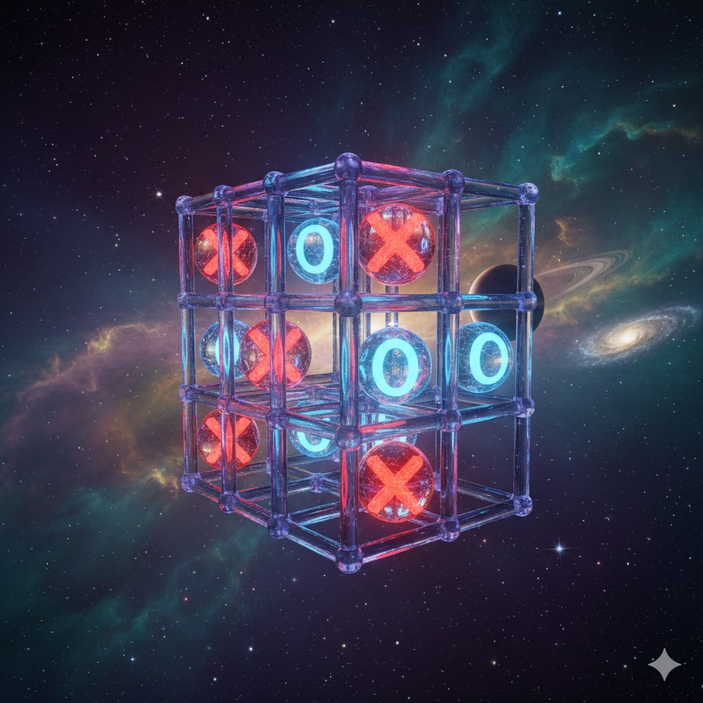

# 🎮 Tic-Tac-Toe Project

> Build a classic game, level up your coding skills, and end with something you can actually *play* 😄

## 🌟 In this project

* You’ll practice **functions**, **loops**, **if statements**, and **clean code**
* You’ll learn how to **break a big problem into small pieces** (real dev skills)
* You’ll finish with a game you can show off to friends/family

**Goal:** Make a playable Tic-Tac-Toe game in the terminal (console) using **functions**

## 🧠 What you’re building

A 2-player game (Player ❌ vs Player ⭕) that:

* shows the board
* lets players pick a spot
* prevents illegal moves
* checks for a winner or a tie
* asks if you want to play again

## 🧩 Project rules (to keep it clean)

✅ Use **functions** for almost everything  
✅ Use a **list** to store the board  
✅ Keep your code readable  

🚫 No giant 200-line spaghetti script

## 🧱 Suggested file

* `tic_tac_toe.py`

## 🗺️ Game plan (build it like a boss)

### Phase 1 — Board basics 🧱

* Create the board data
* Print it nicely

### Phase 2 — Player turns 🎯

* Ask for input
* Validate input
* Place the symbol

### Phase 3 — Win / tie detection 🏁

* Check rows, columns, diagonals
* Detect tie

### Phase 4 — Replay + polish ✨

* Ask “Play again?”
* Add fun messages
* Optional: scoreboard

## 🧰 Function checklist - suggestions

Use these function names (recommended) and build one at a time

### 1) `create_board()` 🧊

**Returns** a new empty board

* Example board format: `['1','2','3','4','5','6','7','8','9']`

### 2) `print_board(board)` 🖼️

Print the board like this:

```
 1 | 2 | 3
---+---+---
 4 | 5 | 6
---+---+---
 7 | 8 | 9
```

### 3) `get_move(player, board)` 🎮

Ask the player to choose a spot

* must handle:

  * not a number
  * number not in 1–9
  * spot already taken

### 4) `make_move(board, position, symbol)` 🧲

Updates the board

### 5) `check_winner(board, symbol)` 🏆

Returns `True` if the symbol has 3 in a row

### 6) `is_tie(board)` 🤝

Returns `True` if no spots left and no winner

### 7) `switch_player(current)` 🔁

Switch between players

### 8) `play_game()` 🚀

Runs the whole game

## 🧪 Mini tests (manual) ✅

Before you declare victory, try these:

* Try entering `0`, `10`, `-2`
* Try entering `abc`
* Try choosing the same spot twice
* Win by row, by column, by diagonal
* Force a tie

## ✨ Bonus challenges (optional)

Pick 1–3 if you want extra fun

### ⭐ Easy

* Add reset option in case the user want to quit the game and start a new game

### ⭐⭐ Medium

* Add a **scoreboard**: X wins, O wins, ties
* Add a computer player which plays random moves

### ⭐⭐⭐ Hard

* Generate a second file with pgame and add graphics, use generated code **only for the graphics** and implement your code inside 

## 🥳 skill fuel

**You’re not just coding a game** — you’re practicing how real projects are built:
✅ design → ✅ functions → ✅ testing → ✅ polish

When it works, you’ll feel that "I MADE THIS" moment 😄

## 🧡 Tiny icon corner

🎯 Input validation = you becoming a pro  
🧱 Functions = clean code superpower  
🏆 Winner check = logic mastery  
✨ Polish = your signature style  

**Submission email:** [pythonai211225+pythontictactoe@gmail.com](mailto:pythonai211225+pythontictactoe@gmail.com)


1. What was Plato doing?
2. Are the things you do now moving you toward your dreams?
